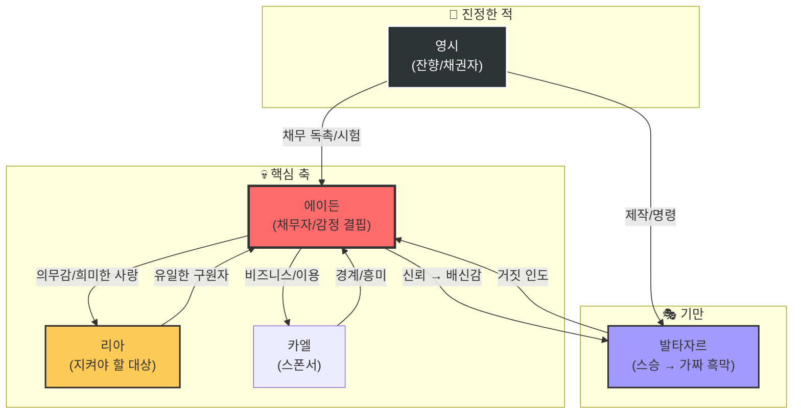

# 🔗 주연 관계망

> **핵심 테마**: 감정의 대가
> **기준**: 영겁의 되밟음 (현재 파멸의 시간선)

---

## 📊 관계 다이어그램



---

## 📋 감정 대가 상태표

**에이든의 내면 상태**: 겉으로는 완벽한 영웅, 속은 텅 빈 껍데기.

### 1. 에이든 ↔ 리아
*   **제1권 구출 전**: 과거의 기억으로 인해 "사랑한다"고 믿음.
*   **제1권 구출 후**: 구출의 대가로 **설렘 증발**.
    *   리아: "아저씨... 왜 그렇게 슬프게 봐요?"
    *   에이든: (아무것도 느껴지지 않아서 당혹스러움) "아니, 기뻐서 그래."

### 2. 에이든 ↔ 아이리스
*   **제2권 이전**: 모르는 사이.
*   **제2권 이후**: 아이리스를 살리는 대가로 **전우애 증발**.
    *   아이리스: "우린 피를 나눈 형제나 다름없다!"
    *   에이든: "그렇군. (무미건조)" -> 아이리스는 에이든을 '쿨한 성격'이라 착각함.

### 3. 에이든 ↔ 발타자르
*   **관계**: 스승과 제자.
*   **특이점**: 발타자르는 에이든의 "감정 상실"을 유일하게 눈치챈 자.
    *   발타자르: "또 하나를 잃었군, 에이든."
    *   에이든: "싸게 먹히는 교환이었습니다."

---

## 🎭 이중 반전 관계도

| 단계 | 독자의 인식 | 진실 |
|------|-------------|------|
| **제1권~제8권** | **잔향(괴물)**이 적이고, **발타자르**는 조력자다. | 잔향은 0회차 에이든, 발타자르는 그의 하수인. |
| **제9권~제11권** | **발타자르**가 변절하여 에이든을 가둔 **흑막(잔향)**이다. | 발타자르는 일부러 악역을 연기하여 에이든을 자극함. |
| **제12권** | **발타자르**는 죽었고, **진짜 잔향(영시)**이 나타났다. | 영시는 에이든을 사랑해서 시련을 준 것. |

---

## 에이전트 지침

```
[RULE: EMOTIONAL_DISCONNECT]
- 에이든의 대사는 상대방의 감정 온도와 미묘하게 어긋나야 함.
- 상대가 뜨거우면 에이든은 차갑고, 상대가 울면 에이든은 덤덤하다.
- 이 '불협화음'이 느와르적 긴장감을 만듦.
```
